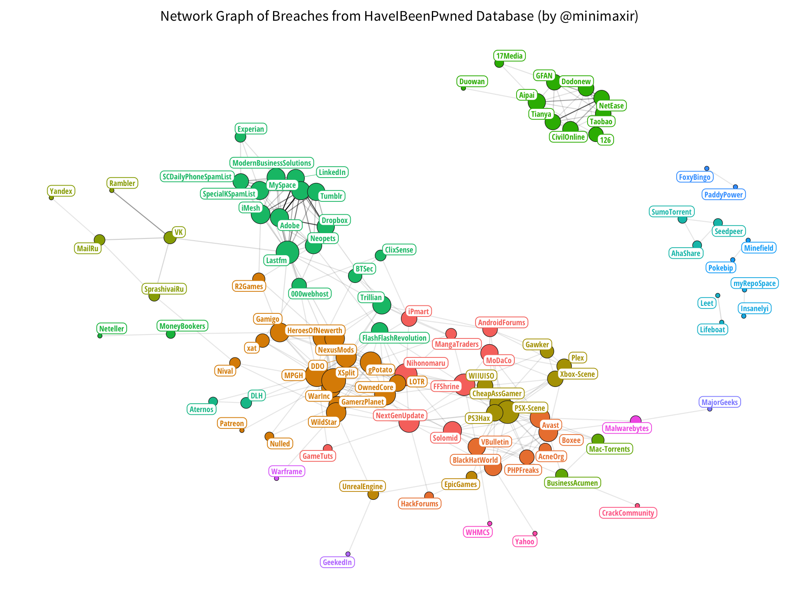

# interactive-network

R Code + R Notebook for creating an interactive graph network of Have I Been Pwned data using R and Plotly.

This R Notebook is the complement to my blog post [Network Visualization of Breached Internet Services Using Have I Been Pwned Data](http://minimaxir.com/2016/12/pwned-network/).

## Maintainer
Max Woolf ([@minimaxir](http://minimaxir.com))

## License
MIT